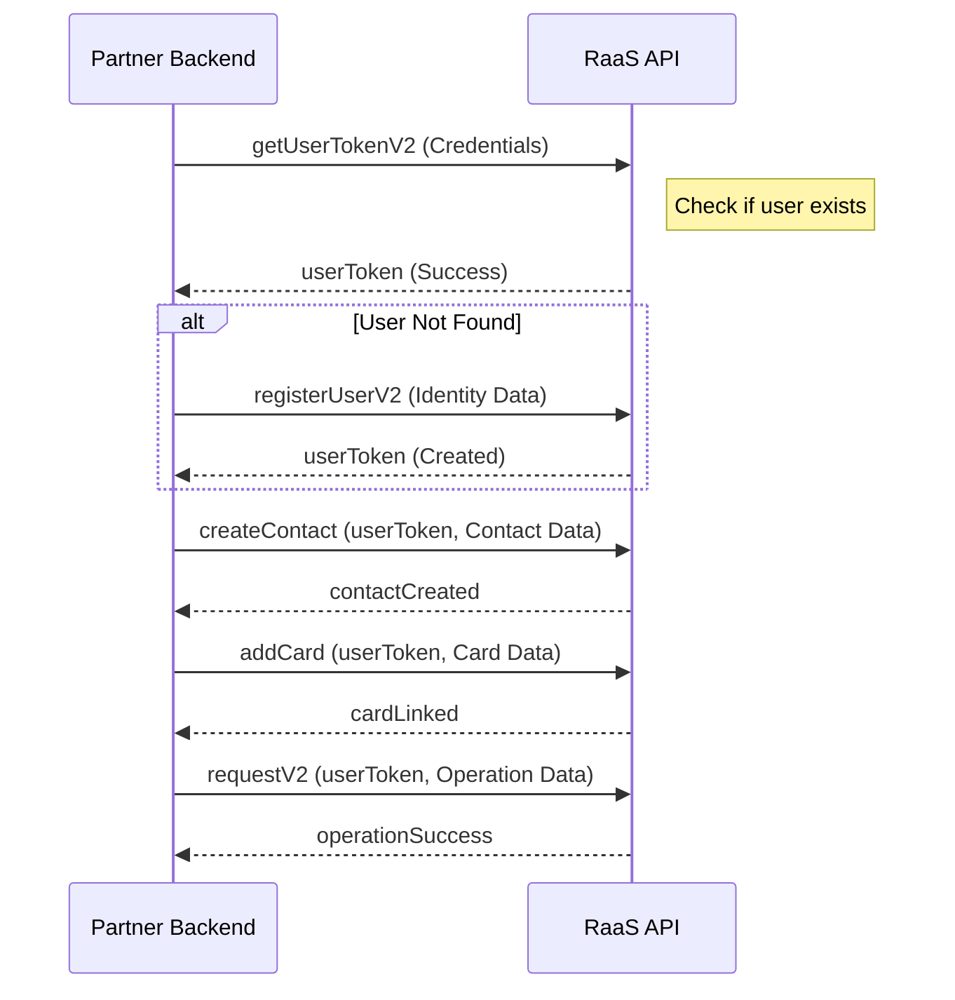

Welcome to the RaaS Partner API Reference. Our platform provides a robust set of tools for integrating financial services, including:

- **Authentication & Security**: Secure access via API keys and user-specific tokens.
- **User & Identity Management**: Comprehensive CIP/KYC workflows and profile management.
- **Funding & Accounts**: Support for multiple funding sources, including bank accounts and cards.
- **Operations & Network**: Real-time money transfers, currency exchange, and network corridor management.

For **sandbox base URLs**, **tokenized test card examples**, and **UBN** testing notes, see [Testing & sandbox](/guides/testing-sandbox).

## mTLS Connection

It is also possible to connect to the RaaS Partner services through mutual TLS (mTLS). For mTLS connections, the base URL changes from:

`https://raas-partner-cv.nomas.cash/v1`

to:

`https://mtls-partner-cv.nomas.cash/v1`

When making calls to the mTLS base URL, you must include the certificate data in the header of the service call.

### Practical Example

Below is an example demonstrating an API call using the mTLS endpoint and providing the certificate data in the request headers:

```bash
curl -X GET "https://mtls-partner-cv.nomas.cash/v1/some-endpoint" \
  -H "Authorization: Bearer <YOUR_ACCESS_TOKEN>" \
  --cert-type P12 \
  --cert ./raas-partner.p12 \
  --data '<ENDPOINT_BODY>'
```

## Happy Path Integration


This section outlines the standard ASK workflow for a successful integration.

1. **Obtain User Token**: Use `getUserTokenV2` to resolve the RaaS `userId` for an existing user (email or phone).
2. **User Registration (Optional)**: If the user does not exist, use `registerUserV2` to create a new profile.
3. **Create Contact**: Establish a funder contact using `createContact`.
4. **Add Receiving Method**: Securely link a card via `addCard` or UBN via `addUBN`.
5. **Execute Request**: Initiate the final transaction or request using `requestV2`.

## Integration Sequence Diagram

The following diagram illustrates the typical interaction between your system and the RaaS API.



## Common HTTP errors (auth)

These apply to `POST /auth/get-user-token-v2` (`getUserTokenV2`) and similar auth routes. Response bodies use JSON with at least a `reason` string unless noted otherwise.

| HTTP | Typical cause | What to do |
|------|----------------|------------|
| 400 | Missing both `phoneNumber` and `email`, invalid email format, or invalid input schema. | Fix the JSON body and retry. |
| 404 | No user matches the normalized phone or email. | Run registration (`registerUserV2`) or verify the alias. |
| 500 | Normalization or lookup failed unexpectedly. | Retry with backoff; if it persists, contact support with timestamps. |
| 401 | Invalid or missing `api_key` header (often enforced before the route handler). | Rotate or configure the API key; never expose it in client-side code. |

## Common HTTP errors (money request)

For `POST /user/operations/request-money-v2/{userToken}` (`requestMoneyV2`), error bodies usually include `code` and `reason`.

| HTTP | Typical cause | What to do |
|------|----------------|------------|
| 400 | Invalid corridor, payment method, contact, or business rule rejection. | Read `reason` / `code`, correct payload or user state, then retry. |
| 500 | Unexpected server or downstream failure. | Retry with backoff; include `correlationId` when opening a support ticket. |

Some operations in the **API Reference** tabs include example request or response JSON to speed up integration; shapes follow the published OpenAPI schemas.
