Este diagrama muestra las dependencias entre los **controllers** del Partner API, los **servicios** que utilizan (en todos los niveles) y la capa de **Platform Connectors** que habla con la plataforma externa. Las flechas indican "usa a".

```mermaid
flowchart TD

  %% Partner Controllers
  subgraph L0[Controllers]
    direction TB
    controllers_partner_authController["controllers/partner/authController"]
    controllers_partner_cipController["controllers/partner/cipController"]
    controllers_partner_contactsController["controllers/partner/contactsController"]
    controllers_partner_corridorController["controllers/partner/corridorController"]
    controllers_partner_eventHookController["controllers/partner/eventHookController"]
    controllers_partner_fundingController["controllers/partner/fundingController"]
    controllers_partner_landingPortController["controllers/partner/landingPortController"]
    controllers_partner_operationsController["controllers/partner/operationsController"]
    controllers_partner_ratesController["controllers/partner/ratesController"]
    controllers_partner_serviceController["controllers/partner/serviceController"]
  end

  subgraph L1[Level 1]
    direction TB
    services_CIPService["services/CIPService"]
    services_cipv2_CIPService["services/cipv2/CIPService"]
    services_CorridorsService["services/CorridorsService"]
    services_CountriesService["services/CountriesService"]
    services_FundingService["services/FundingService"]
    services_LandingPortService["services/LandingPortService"]
    services_LinksService["services/LinksService"]
    services_MapsService["services/MapsService"]
    services_NotificationService["services/NotificationService"]
    services_OperationService["services/OperationService"]
    services_PaymentMethodService["services/PaymentMethodService"]
    services_PhoneNumberService["services/PhoneNumberService"]
    services_security["services/security"]
    services_StatusService["services/StatusService"]
    services_TenantService["services/TenantService"]
    services_UserServices["services/UserServices"]
  end

  subgraph L2[Level 2]
    direction TB
    services_FileStoreFactory["services/FileStoreFactory"]
    services_helpers_subscribers_helper["services/helpers/subscribers_helper"]
    services_ImageService["services/ImageService"]
    services_implementations_sms_SMSProviderFactory["services/implementations/sms/SMSProviderFactory"]
    services_kyc_engines_LevelOneEngineManager["services/kyc/engines/LevelOneEngineManager"]
    services_kyc_engines_ProofOfLifeEngineManager["services/kyc/engines/ProofOfLifeEngineManager"]
    services_kyc_engines_ScanEngineManager["services/kyc/engines/ScanEngineManager"]
    services_PartnerUserRegistrationService["services/PartnerUserRegistrationService"]
    services_UserRegistrationService["services/UserRegistrationService"]
  end

  subgraph L3[Level 3]
    direction TB
    services_implementations_sms_AWSProvider["services/implementations/sms/AWSProvider"]
    services_implementations_sms_TwilioProvider["services/implementations/sms/TwilioProvider"]
    services_kyc_engines_plat_lolaVisionClient["services/kyc/engines/plat/lolaVisionClient"]
    services_kyc_ILevelOneEngine["services/kyc/ILevelOneEngine"]
    services_kyc_IProofofLifeEngine["services/kyc/IProofofLifeEngine"]
    services_kyc_IScanEngine["services/kyc/IScanEngine"]
  end

  subgraph L_conn[Platform Connectors]
    direction TB
    platformConnectors_cashNetworkConnector["platformConnectors/cashNetworkConnector"]
    platformConnectors_lcConnector["platformConnectors/lcConnector"]
    platformConnectors_nesConnector["platformConnectors/nesConnector"]
    platformConnectors_operationConnector["platformConnectors/operationConnector"]
    platformConnectors_paymentMethodConnector["platformConnectors/paymentMethodConnector"]
    platformConnectors_tpeServiceConnector["platformConnectors/tpeServiceConnector"]
    platformConnectors_walletConnector["platformConnectors/walletConnector"]
  end

  controllers_partner_authController --> services_UserServices
  controllers_partner_authController --> services_security
  controllers_partner_authController --> services_FundingService
  controllers_partner_authController --> services_CIPService
  controllers_partner_authController --> services_LinksService
  controllers_partner_authController --> services_PhoneNumberService
  controllers_partner_authController --> services_TenantService
  controllers_partner_authController --> services_NotificationService
  controllers_partner_authController --> services_CountriesService
  controllers_partner_authController --> platformConnectors_paymentMethodConnector
  controllers_partner_cipController --> services_CIPService
  controllers_partner_cipController --> services_UserServices
  controllers_partner_cipController --> services_security
  controllers_partner_cipController --> services_cipv2_CIPService
  controllers_partner_cipController --> services_TenantService
  controllers_partner_cipController --> services_OperationService
  controllers_partner_cipController --> platformConnectors_tpeServiceConnector
  controllers_partner_contactsController --> services_PhoneNumberService
  controllers_partner_contactsController --> services_UserServices
  controllers_partner_contactsController --> services_OperationService
  controllers_partner_corridorController --> services_UserServices
  controllers_partner_corridorController --> services_FundingService
  controllers_partner_corridorController --> services_TenantService
  controllers_partner_corridorController --> services_CorridorsService
  controllers_partner_fundingController --> services_FundingService
  controllers_partner_fundingController --> services_PaymentMethodService
  controllers_partner_fundingController --> services_OperationService
  controllers_partner_fundingController --> services_UserServices
  controllers_partner_fundingController --> services_TenantService
  controllers_partner_fundingController --> services_CountriesService
  controllers_partner_fundingController --> platformConnectors_paymentMethodConnector
  controllers_partner_landingPortController --> services_LandingPortService
  controllers_partner_landingPortController --> services_OperationService
  controllers_partner_operationsController --> services_OperationService
  controllers_partner_operationsController --> services_UserServices
  controllers_partner_operationsController --> services_FundingService
  controllers_partner_operationsController --> services_PaymentMethodService
  controllers_partner_operationsController --> services_LinksService
  controllers_partner_operationsController --> services_CountriesService
  controllers_partner_serviceController --> services_LinksService
  controllers_partner_serviceController --> services_MapsService
  controllers_partner_serviceController --> services_CountriesService
  controllers_partner_sysController --> services_StatusService
  controllers_partner_testHelperController --> services_UserServices
  controllers_partner_testHelperController --> services_TenantService
  controllers_partner_userController --> services_security
  services_UserServices --> services_security
  services_UserServices --> services_helpers_subscribers_helper
  services_UserServices --> services_kyc_engines_ProofOfLifeEngineManager
  services_UserServices --> services_ImageService
  services_UserServices --> services_cipv2_CIPService
  services_UserServices --> platformConnectors_lcConnector
  services_UserServices --> platformConnectors_tpeServiceConnector
  services_UserServices --> services_PartnerUserRegistrationService
  services_UserServices --> services_UserRegistrationService
  services_FundingService --> platformConnectors_paymentMethodConnector
  services_FundingService --> platformConnectors_operationConnector
  services_FundingService --> platformConnectors_cashNetworkConnector
  services_FundingService --> platformConnectors_walletConnector
  services_FundingService --> services_UserServices
  services_CIPService --> services_kyc_engines_ScanEngineManager
  services_CIPService --> services_kyc_engines_ProofOfLifeEngineManager
  services_CIPService --> services_kyc_engines_LevelOneEngineManager
  services_CIPService --> services_ImageService
  services_CIPService --> services_UserServices
  services_CIPService --> services_security
  services_CIPService --> platformConnectors_tpeServiceConnector
  services_PhoneNumberService --> services_CountriesService
  services_PhoneNumberService --> platformConnectors_tpeServiceConnector
  services_TenantService --> platformConnectors_nesConnector
  services_NotificationService --> services_implementations_sms_SMSProviderFactory
  services_cipv2_CIPService --> services_ImageService
  services_cipv2_CIPService --> services_kyc_engines_ProofOfLifeEngineManager
  services_cipv2_CIPService --> platformConnectors_tpeServiceConnector
  services_OperationService --> services_LinksService
  services_OperationService --> services_UserServices
  services_OperationService --> services_ImageService
  services_OperationService --> services_NotificationService
  services_OperationService --> services_CorridorsService
  services_OperationService --> services_TenantService
  services_OperationService --> services_cipv2_CIPService
  services_OperationService --> services_security
  services_OperationService --> services_LandingPortService
  services_OperationService --> platformConnectors_operationConnector
  services_OperationService --> platformConnectors_walletConnector
  services_CorridorsService --> services_TenantService
  services_CorridorsService --> platformConnectors_operationConnector
  services_custom_externalWidgetService --> services_cipv2_CIPService
  services_custom_externalWidgetService --> services_FileStoreFactory
  services_PaymentMethodService --> platformConnectors_operationConnector
  services_PaymentMethodService --> platformConnectors_paymentMethodConnector
  services_LandingPortService --> services_TenantService
  services_LandingPortService --> services_UserServices
  services_kyc_engines_ProofOfLifeEngineManager --> services_kyc_IProofofLifeEngine
  services_ImageService --> services_FileStoreFactory
  services_ImageService --> services_kyc_engines_plat_lolaVisionClient
  services_PartnerUserRegistrationService --> services_security
  services_PartnerUserRegistrationService --> services_helpers_subscribers_helper
  services_PartnerUserRegistrationService --> platformConnectors_lcConnector
  services_UserRegistrationService --> services_security
  services_UserRegistrationService --> services_helpers_subscribers_helper
  services_UserRegistrationService --> platformConnectors_lcConnector
  services_UserRegistrationService --> platformConnectors_tpeServiceConnector
  services_kyc_engines_ScanEngineManager --> services_kyc_IScanEngine
  services_kyc_engines_LevelOneEngineManager --> services_kyc_ILevelOneEngine
  services_implementations_sms_SMSProviderFactory --> services_implementations_sms_TwilioProvider
  services_implementations_sms_SMSProviderFactory --> services_implementations_sms_AWSProvider
```

## Resumen

- **L0 (Controllers)**: 17 controllers del Partner API. Algunos (`configController`, `ratesController`, `tenantController`, `eventHookController`, `partnerDemoController`) no aparecen con flechas porque solo dependen de **interfaces/providers** (por ejemplo `ITenantStorageProvider`, `IExchangeRateProvider`, `ILogger`), no de módulos de servicio concretos; esos providers se inyectan desde fuera y no se incluyen en este grafo.
- **L1**: Servicios usados directamente por los controllers (auth, CIP, funding, operaciones, links, notificaciones, etc.).
- **L2**: Servicios usados por los de L1 (KYC engines, SMS factory, imagen, registro de usuarios, helpers).
- **L3**: Capa más profunda de servicios (proveedores SMS Twilio/AWS, interfaces de motores KYC, cliente Lola Vision).
- **Platform Connectors**: Capa que abstrae la comunicación con la plataforma externa. Incluye: `tpeServiceConnector`, `lcConnector`, `operationConnector`, `paymentMethodConnector`, `walletConnector`, `cashNetworkConnector`, `nesConnector`. Algunos controllers (auth, cip, funding, externalWidget) y la mayoría de los servicios de L1/L2 los usan directamente.

El diagrama se generó automáticamente a partir de los `import` en `src/controllers/partner`, `src/services` y `src/platformConnectors` (se excluyen `platformModels` e interfaces bajo `interfaces/`).
