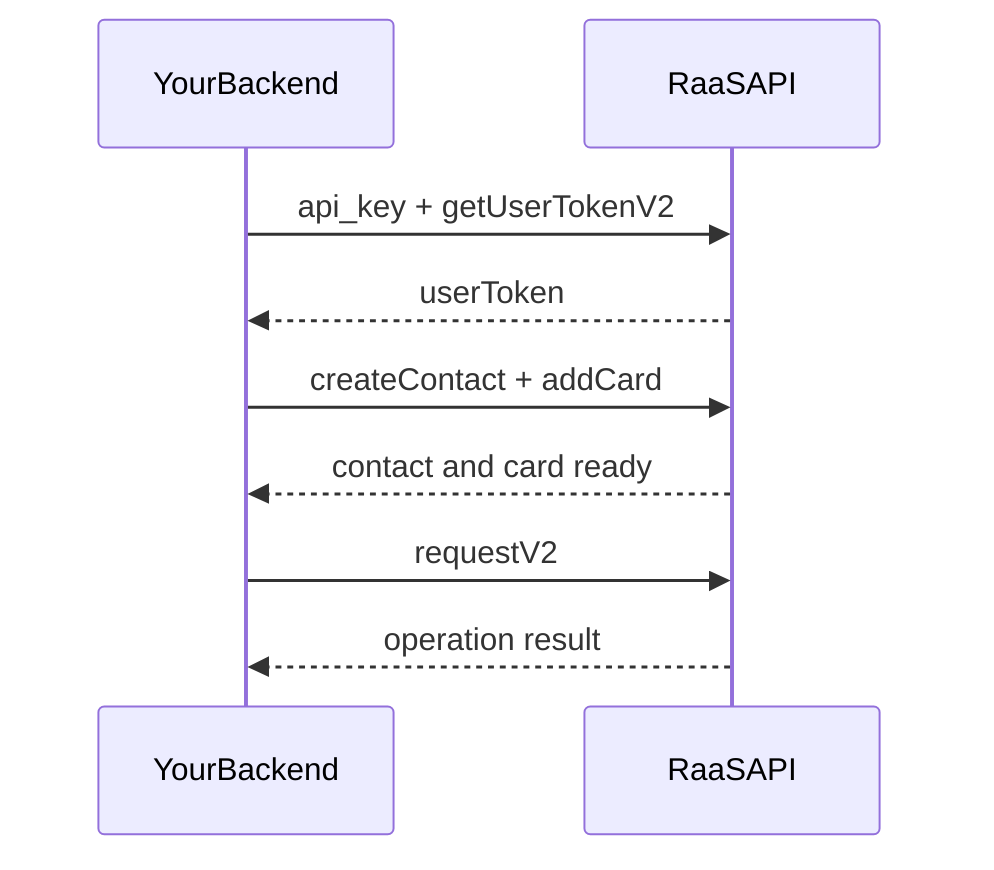

RaaS (Remittance-as-a-Service) exposes REST APIs your backend calls to onboard users, manage funding methods, and run **Ask** (request money) flows. You authenticate with a tenant **api_key** and, for user-scoped routes, a **userToken** issued by the platform.

## How a typical Ask flow works

<Steps>
  <Step title="Get credentials">
    Obtain a sandbox **api_key** and confirm your **base URL** with Leap (see [Testing & sandbox](/raas/guides/testing-sandbox)).
  </Step>
  <Step title="Resolve or create the user">
    Call `getUserTokenV2` with phone or email; use `registerUserV2` when the user does not exist yet.
  </Step>
  <Step title="Model funding and execute">
    Create contacts, add cards or UBN accounts, then call `requestV2` / related operation endpoints for your corridor.
  </Step>
  <Step title="Go live">
    Swap base URLs and keys for production, complete security review (no secrets in clients), and register webhooks if you consume events.
  </Step>
</Steps>

## Core concepts

<AccordionGroup>
  <Accordion title="API keys and user tokens">
    The **api_key** identifies your tenant on every request. **userToken** scopes routes to one end user and is obtained from auth endpoints—never log or expose it in browsers.
  </Accordion>
  <Accordion title="Environments">
    Sandboxes use non-production hosts (for example `https://raas-partner-cv.nomas.cash/v1`). Your contract may use a different hostname; confirm with your integration contact.
  </Accordion>
  <Accordion title="OpenAPI tabs">
    **API Reference** is generated from `swagger-partner.json`. Widget and **Client Interfaces** specs live in separate tabs and describe optional or partner-implemented surfaces.
  </Accordion>
</AccordionGroup>

## Next steps

<CardGroup cols={2}>
  <Card title="Quickstart" icon="bolt" href="/raas/quickstart">
    Make your first authenticated calls in minutes.
  </Card>
  <Card title="Authentication" icon="key" href="/raas/authentication">
    Headers, errors, and safe handling of credentials.
  </Card>
  <Card title="API overview" icon="book-open" href="/raas/api-reference/introduction">
    mTLS, happy path, and common HTTP errors.
  </Card>
  <Card title="Testing & sandbox" icon="flask" href="/raas/guides/testing-sandbox">
    Base URLs, sample cards, and integration tips.
  </Card>
</CardGroup>

## Environments

| Environment | Example REST base URL | Notes |
|-------------|------------------------|-------|
| Sandbox / CV | `https://raas-partner-cv.nomas.cash/v1` | Illustrative; your tenant may differ. |
| mTLS (same API) | `https://mtls-partner-cv.nomas.cash/v1` | Send client certificate data as required by your integration. |

<Warning>
  Do not use **production** API keys or user data in development tools, shared sandboxes, or source control.
</Warning>
